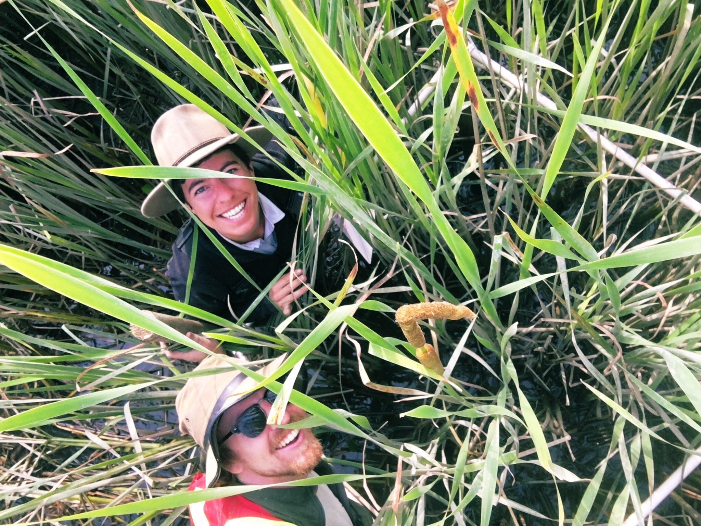

# STAT545A Homework Assignment Repo

## Repo Overview

This repo contains Daniel Stewart's assignments the Fall 2019 STAT 545A course. Assignments are placed into separate folders to aid in navigation. Should you have any further questions, please email Daniel [**here**](daniel.stewart@ubc.ca).

## Introduction

I (Daniel) am a graduate student in the Department of Forestry working under Dr. Tara Martin. My reseach is focussed on a recently-arrived invasive plant species in the region (*Typha x glauca*) and the management actions that may prevent its establishment. I have included a photo of my Research Assistant (top) and I (bottom) from my recent field campaign. 

