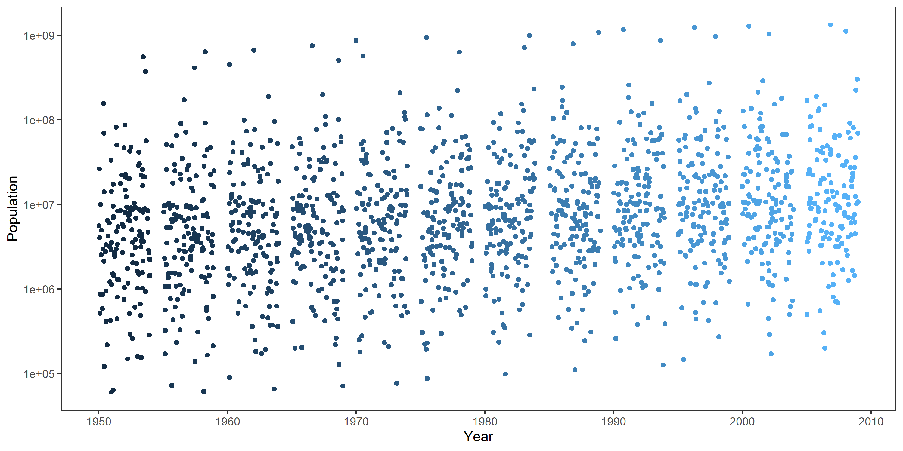

Installed Packages:

  + install.packages("tidyverse")
  + install.packages("singer")
  + install.packages("ggplot2")
  + install.packages("tidyr")
  + install.packages("readr")
  + install.packages("ggpubr")
  
  **Note to reviewers: "ggpubr" may not be installed on your device**

```{r setup, include=FALSE}
suppressPackageStartupMessages(library(dplyr))
suppressPackageStartupMessages(library(forcats))                            
suppressPackageStartupMessages(library(ggplot2))
suppressPackageStartupMessages(library(readr))
(library(singer))
(library(gapminder))
```

## Exercise 1: The Value of here::here Package

This function is a powerful tool for reliably constructing pathways to files based on the current directory at the time the package is loaded. Unlike setwd(), which is fragile to any change in directories, platforms or file names, here::here is flexible and adaptive, capable of locating files using reasonable heuristics.

As a result of this adaptive file search power, it is much easier to use sub-directories within projects, and we can now easily avoid problematic and clunky alternatives (e.g. set(wd), rm(lst = ls()), large directories). We can also move files freely within the project directory without having to change any relative directory. In short, the power of here is that it reduces many of the headaches associated with sharing/moving/renaming data between platforms and devices. 

## Exercise 2: Factor Management

### Part A: pre-Modified gapminder data
```{r}
levels(gapminder$continent) #number/names  of continents
nlevels(gapminder$country) #number of countries
gapminder
```

### Part B: Modified gapminder data
```{r}
Filtered_gapminder <- gapminder %>%
  filter(continent != "Oceania") %>%
  droplevels() 

levels(Filtered_gapminder$continent) #number/names of continents
nlevels(Filtered_gapminder$country) #number of countries
Filtered_gapminder
```
The original gapminder dataset contained 5 continents, 142 countries and 1,704 rows. My filtering work reduced this dataset to 4 continents, 140 countries and 1,680 rows.

### Part C: Reordering of factors

```{r}
Populations_NA <- Filtered_gapminder %>%
  group_by(country) %>%
  filter(year==1952, continent == "Americas") %>%
  summarise(population = mean(pop, na.rm =TRUE))

#Un-ordered
unordered <- ggplot(Populations_NA, aes(population, country)) +
  geom_point() + 
  labs(x= "Population", y = "Country") +
  theme_bw() + #removes background
  theme(panel.grid.major = element_blank(), panel.grid.minor = element_blank())

#Re-ordered
ordered <-ggplot(Populations_NA, aes(population, fct_reorder(country, population))) +
  geom_point() +
  labs(x= "Population", y = "Country") +
  theme_bw() + #removes background
  theme(panel.grid.major = element_blank(), panel.grid.minor = element_blank())

COMPARISON <-ggpubr::ggarrange(unordered, ordered,
                    labels = c("A", "B"),
                    ncol = 2, nrow = 1) 
COMPARISON
```

The above plots demonstrate the ability of using "fct_reorder" to manipulate how you display data. Plot A was ordered in reverse alphabetical (default setting), whereas Plot B was reordered from highest population to lowest. 


## Exercise 3: File input/output (I/O)

### Part A: Grouping & exporting 2007 gapminder data 
```{r}
Data_2007 <- gapminder %>% 
  filter(year == 2007) %>% 
  mutate(population_level = factor(case_when(pop < 10000000 ~ 'very low',
                            pop < 50000000 ~ 'low',
                            pop < 100000000 ~ 'moderate',
                            pop < 500000000 ~ 'high',
                            TRUE ~ 'very high'),
  levels = c("very low", "low","moderate", "high","very high")))

write_csv(Data_2007, here::here("hw05","Data_2007.csv"))
```

### Part B: Importing the previous dataset
```{r}
read_csv(here::here("hw05","Data_2007.csv"))
```
The imported dataset is identical to the exported dataset.

## Exercise 4: Visualization design

```{r}
OLDPLOT <- ggplot(gapminder) +
  geom_boxplot (aes(factor(year), pop)) +
  xlab("Year") +
  ylab("Population") + 
  scale_y_log10() 

REVISEDPLOT <- gapminder %>%
  ggplot() +
  geom_jitter(aes(year, pop, color = year),show.legend = FALSE, alpha = 0.25) + #removes unneccessary legend
  scale_y_log10() +
  labs(x="Year", y="Population") + 
  theme_bw() + #removes background
  theme(panel.grid.major = element_blank(), panel.grid.minor = element_blank()) #removes gridlines


COMBINED <-ggpubr::ggarrange(OLDPLOT, REVISEDPLOT,
                    labels = c("A", "B"),
                    ncol = 1, nrow = 2) 
COMBINED
```

Above is a plot that I created for Assignment 2 (A) and a revised plot using the same data for this assignment (B). To improve plot A I removed the grey background, converted the boxplot format to jitter to improve viewability, and added a colour gradient to help in distinguishing years.

## Exercise 5 

### Part A: Saving a .png of the revised jitter plot
```{r}
gapminder %>%
  ggplot() +
  geom_jitter(aes(year, pop, color = year),show.legend = FALSE) + #removes unneccessary legend
  scale_y_log10() +
  labs(x="Year", y="Population") + 
  theme_bw() + #removes background
  theme(panel.grid.major = element_blank(), panel.grid.minor = element_blank()) 

  ggsave(file="revised_jitter.png", scale = 1, width = 10, height = 5) # adjusted plot size
```

### Part B: Loading and embedding this .png to my report




